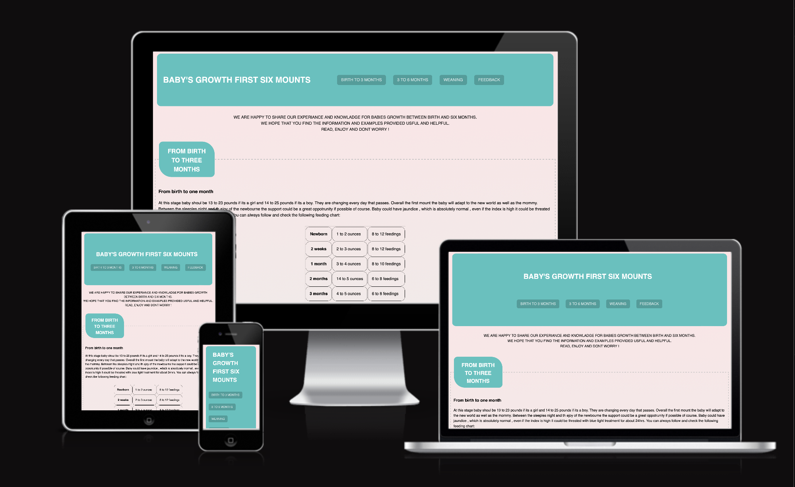
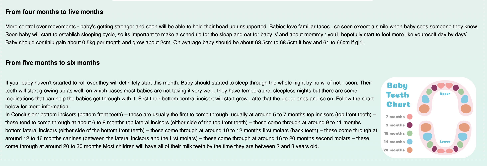
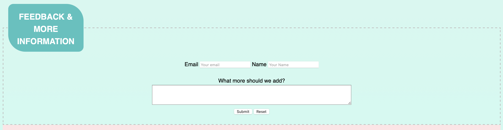
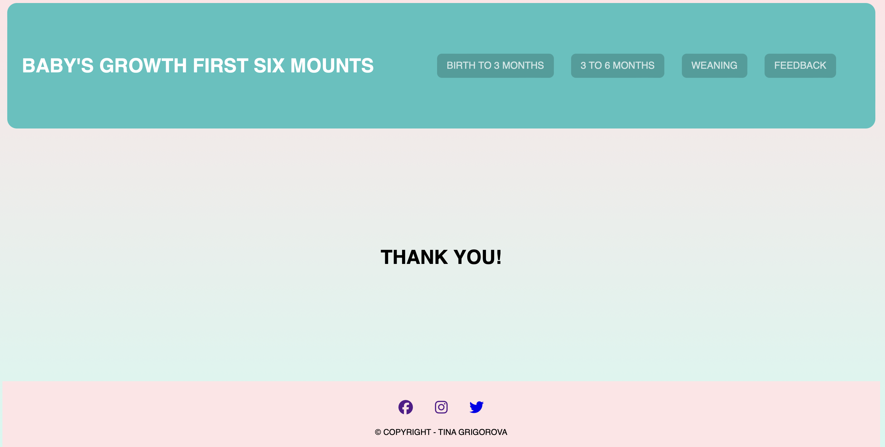

# BABY'S GROWTH 

* Baby's Growth page is dedicated to support new mums with loads of questions about their little one. 
Starting from birth to six monts. Covering different topics, giving examples, and ending with feedback part so the readers can sumbit their opinion, which could be request even  just for additional information to be added, or simply giving a review for the page.
 

* [Link to my website](https://tinagrigorova.github.io/baby_growth/)

--- 
## USER EXPERIANCE (UX)
### User stories

 * First-time visitor goals
    * Understand the main purpose of the site and acquire more knowledge about the topic.
    * Easily navigate throughout the site.
    * Find the Feedback form and submit.
      
 * Returning visitor goals
    * Find out information about growth of the baby.
    * Locate the feedback form at the end of the page.
    * Review stories and more information on social media.

 * Frequent user goals
    * Request more information or examples to be added via feedback form. 
    * Review the page for new information.
      
   --- 
## FEATURES 
* Baby growth web page is dedicated to support new and existing mums that are looking for more information on how the beby is developing.
* Readers can navigate easy on the page by choosing the option on the navigation bar.
* Responsive on all devices.
  

### Navigation bar
 * Navigation bar icludes all four section of the website
    * From Birth to Three months
    * From Three to Six months
    * Weaning
    * Feedback
 * Made for easy navigation through the sections by choosing on the navigation menu the requred section
 * Easy to read and visualise 

### Heading
* Heading is visible and readable
* Positioned on the left side of the header to give more space for the navigation menu.

* Intruduction of the webside is positioned just below the heading and the navigation.
* It is easy to locate and read.
* Positioned in the center so the readers can understand easily what the website is about.
  

### Content 

#### Feeding 

* Section - Feeding is designed to support and inform new perants with information how much the baby eats and how frequently.This section is supplied with an example table with average times and amount of feeding the baby.
* Feeding section includes more information about how the babies are growing during that period of time that includes weight, length , brain development, hearing and more.

#### Growing

#### Teething 

#### Weaning 

### Feedback
* Feedback page will allow users to share their opinion and ideas.
* Users can enter thir email , name and their point of view. 
* When feedback is submitted it opens new page which confirms to the users that they have submitted their feedback.
* Thank-you page includes the heading and navigation menu of the website. 

### Footer
* Footer includes links to social media websites, which open in new tab when clicked.
* The footer helps the users to stay tuned in social media for updates on the webpage.

## DESIGN

### Colors

#### Primary colors used:

 

--- 
### Features left to implement

* Мore information and sections to be added to the web page.
* To be added one more page which will include information about baby growth from six months to one year.

### Typography
* Sans-Serif is the main font used in th website.

---
## USED TECHNOLOGIES

 * [HTML5](https://en.wikipedia.org/wiki/HTML5)
 * [CSS3](https://en.wikipedia.org/wiki/CSS)
   
## FRAMEWORKS, PROGRAMS AND LIBRARYS USED 

 * [VS Desktop](https://code.visualstudio.com)
    * To write the code in the beginng. 
 * [Github](https://github.com/)
    * To write and update the code.
 * [Git](https://git-scm.com/)
    * for vesion control.
 * [Github](https://github.com/)
    * Deployment of the website and storing the files online.
* [Am I Responsive](https://ui.dev/amiresponsive)
    * Mockup picture for the README file.
---

## TESTING

The W3C Markup Validator and W3C CSS Validator services were used to validate every page of the project to ensure there were no errors.

 * [W3C Markup Validtor](https://validator.w3.org/)
 * [W3C CSS Validator](https://jigsaw.w3.org/css-validator/)

### Results
 * After validating and checking the code with [W3C Markup Validtor](https://validator.w3.org/) the results were positive and no errors or warnigns were fould in HTML code.
   * 

 * After validating and checking the code with [W3C CSS Validator](https://jigsaw.w3.org/css-validator/) the results were positive and no errors were fould in the CSS code.
   * 

### Manual testing

 * The website was tested on Safari and Microsoft Edge.
 * The website was viewed on a desktop computer, laptop, and Iphone 14 Pro Max mobile phone.
 * Large amount of testing was done to ensure links between pages are working correctly on all pages.
 * Dev Tools was used to test how the site looks on various screen sizes.

### Fixed bugs

* On section - One to two monts - the text paragraph was not alihning well with the picture as property of "width - 50%" has been added to the div. But it has been removed and now is fixed.

---
## DEPLOYMENT AND LOCAL DEVELOPMENT

### GitHub

* The site was deployed to GitHub pages.

 * Log in to GitHub and locate Github Repository [Baby Growth](https://github.com/TinaGrigorova/baby_growth.git)
 * At the top of the Repository(not the main navigation) locate "Settings" button on the menu.
 * Scroll down the Settings page until you locate "GitHub Pages".
 * Under "Source", click the dropdown menu "None" and select "Main" and click "Save".
 * The page will automatically refresh.
 * Scroll back to locate the now-published site link in the "GitHub Pages" section.

--- 
## CREDITS

### Code

* Understanding the concept of flexbox was learned through [Complete Guide to Flexbox](https://css-tricks.com/snippets/css/a-guide-to-flexbox/)
* The README template was helpfully provided by [Code Institute (template)](https://github.com/Code-Institute-Solutions/SampleREADME)
  
### Content

* All content was written by the developer.
* [Color contrast checker](https://coolors.co/contrast-checker/000000-44c3bf) was used to decide which colors would be used for the website.

### Media

* As the website does not include "gallery" page the following links were used for the few photos :
  * [Baby Feeding](https://www.parents.com/baby/feeding/baby-feeding-chart-how-much-and-when-to-feed-infants-the-first-year/)
  * [Baby's Developement](https://www.istockphoto.com/photos/baby-development)
  * [Baby Teeth Chart](https://www.template.net/business/charts/sample-baby-teeth-growth-chart/)
  * [Backgroung Img](https://hypercolor.dev/)

### Acknowledgements

 * My mentor Mitko Bachvarov provided realy helpful feedback and a links to Flexbox gude for my portfolio.
 * Slack community for encouragement, information and support from the students.

